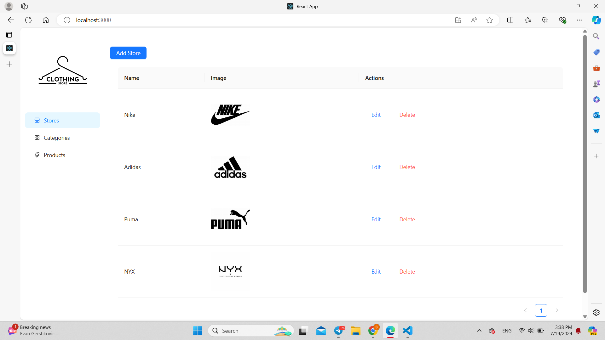
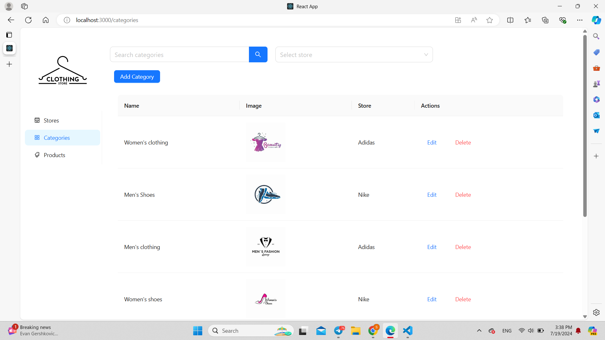
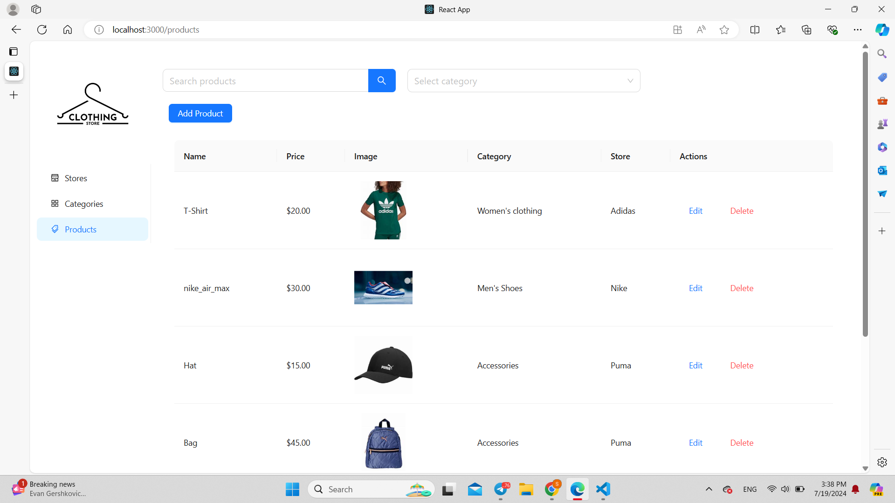

# Store Admin Dashboard

## Overview

The **Store Admin Dashboard** is a React-based web application designed to manage stores, categories, and products. The dashboard provides functionalities to add, update, and delete stores, categories, and products. It includes features such as filtering and searching to enhance user experience and facilitate efficient management.

## Features

- **Store Management**: Add, update, and delete stores.
- **Category Management**: Add, update, and delete categories. Each category can be associated with a store.
- **Product Management**: Add, update, and delete products. Products can be linked to categories and stores.
- **Search and Filtering**:
  - **Categories**: Search categories by name and filter category by store.
  - **Products**: Search products by name and filter products by category.

## Screenshots


*Store Management Screen*


*Category Management Screen*


*Product Management Screen*

## Technologies Used

- **React**
- **Ant Design** 
- **LocalStorage**
- **CSS**

## Packages and Dependencies

- `react`: ^18.2.0
- `react-dom`: ^18.2.0
- `react-scripts`: ^5.0.0
- `@ant-design/icons`: ^5.3.7
- `react-router-dom`: ^6.24.1
- `antd`: ^5.0.0

## Setup and Installation

1. **Clone the Repository**:

   ```bash
   git clone https://github.com/your-username/store-admin-dashboard.git
   cd store-admin-dashboard
   ```

2. **Install Dependencies**:

   Ensure you have [Node.js](https://nodejs.org/) installed. Then, install the necessary packages:

   ```bash
   npm install
   ```

3. **Run the Application**:

   Start the development server:

   ```bash
   npm start
   ```

   The application should now be running on `http://localhost:3000`.

## Contact

For any questions or feedback, please contact (sara.yassen727@gmailcom).
